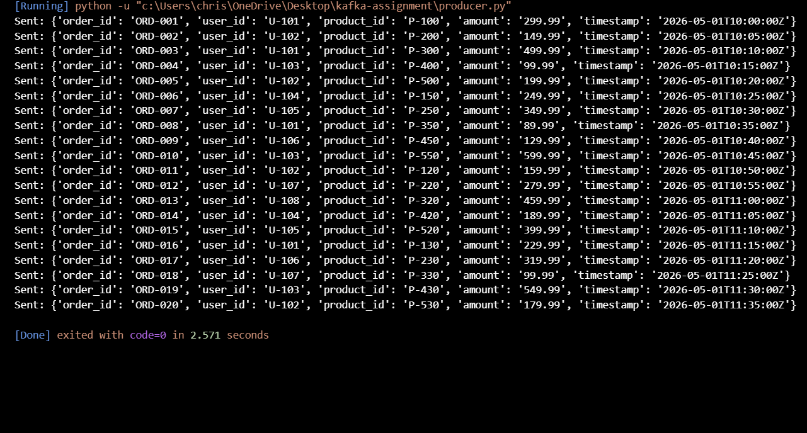
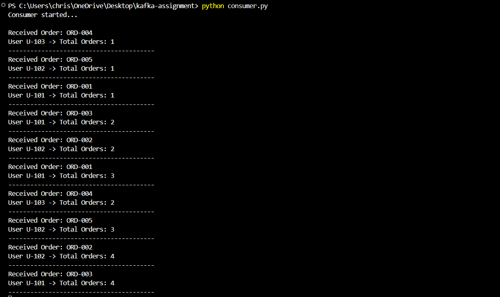
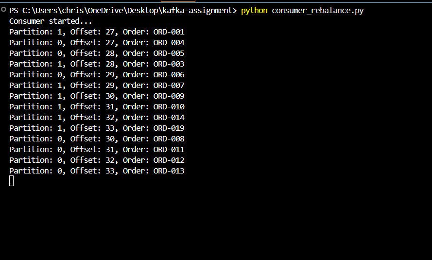
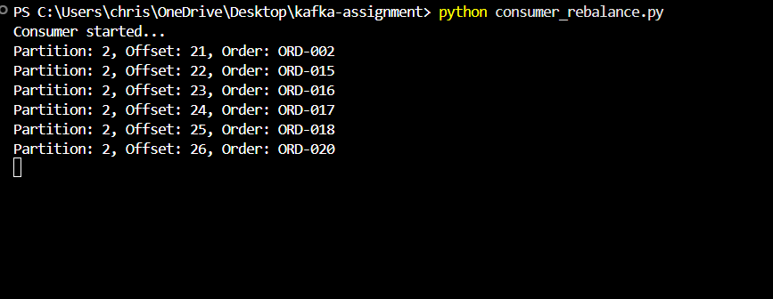
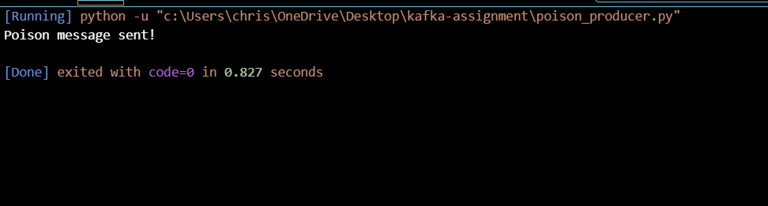
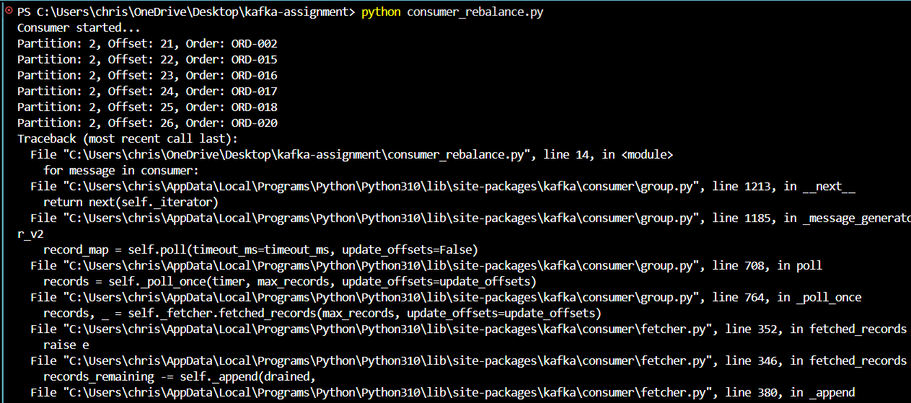
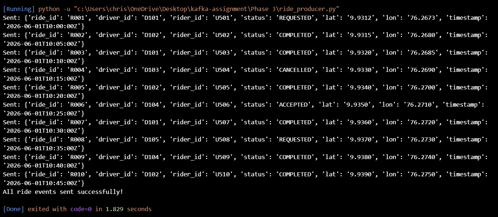
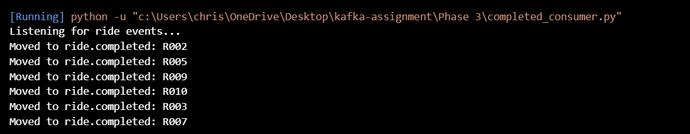
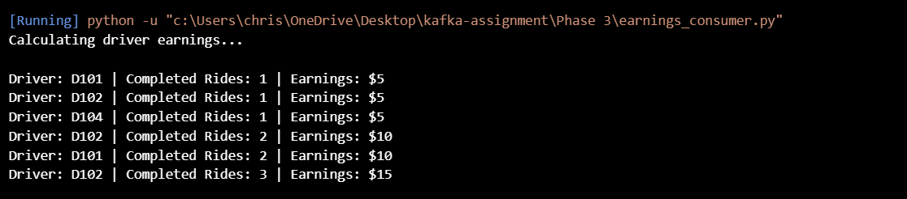
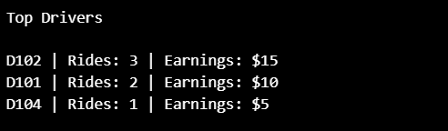

# Apache Kafka Internship Assignment

> **Author:** Christeena Johny — B.Tech Computer Science Engineering

A hands-on implementation of Apache Kafka covering core fundamentals, an e-commerce event processing pipeline, and a ride-sharing analytics pipeline.

---

## Technologies Used

| Tool | Purpose |
|------|---------|
| Apache Kafka | Message broker |
| Docker (KRaft mode) | Kafka deployment without ZooKeeper |
| Python 3.10 | Producer & consumer scripts |
| kafka-python | Kafka client library |

---

## Features

- Apache Kafka setup using Docker (KRaft mode)
- CSV-based Producer and Consumer applications
- Consumer Group Rebalancing
- Poison Message Handling
- Dead Letter Topic (DLT) Design
- Ride Event Processing Pipeline
- Driver Earnings Aggregation
- Top Drivers Analytics CLI
  
## Repository Structure

```
kafka-assignment/
│
├── .gitignore
├── docker-compose.yml
├── orders.csv
├── rides.csv
│
├── docs/
│   └── Apache Kafka - Task 1.docx
│
├── Phase 2/
│   ├── producer.py
│   ├── consumer.py
│   ├── consumer_rebalance.py
│   └── poison_producer.py
│
├── Phase 3/
│   ├── ride_producer.py
│   ├── completed_consumer.py
│   ├── earnings_consumer.py
│   ├── top_drivers.py
│   └── RideArchitecture.drawio.png
│
└── Screenshots/
    ├── producerTask1.png
    ├── consumerTask1.png
    ├── Consumer_count.png
    ├── rebalancing1.png
    ├── rebalancing2.png
    ├── Poisonmsg.png
    ├── poisonsent.png
    ├── ridemsgSent.png
    ├── RideEventsCompleted.png
    ├── DriverEarnings.png
    └── BestDriver.png
```

---

# Phase 1 — Kafka Fundamentals

Kafka was deployed locally using Docker in **KRaft mode** (no ZooKeeper). Core concepts studied and demonstrated:

| Concept | Description |
|---------|-------------|
| Topic | Named log where messages are published |
| Partition | Ordered sub-division of a topic |
| Offset | Position of a message within a partition |
| Broker | Kafka server managing topics and partitions |
| Producer | Client that writes messages |
| Consumer | Client that reads messages |
| Consumer Group | Group of consumers sharing partition load |
| Replication Factor | Number of copies of each partition |
| ISR | In-Sync Replicas — replicas caught up with the leader |
| KRaft Mode | Kafka's built-in consensus without ZooKeeper |

---

# Phase 2 — E-Commerce Event Processing

## Task 2.1 — Producer

`producer.py` reads order data from `orders.csv` and publishes each record as a JSON message to the `ecommerce.orders` topic using `order_id` as the message key.

**Message fields:** `order_id`, `user_id`, `product_id`, `amount`, `timestamp`

### Screenshot — Producer sending messages



---

## Task 2.2 — Consumer

`consumer.py` subscribes to `ecommerce.orders`, prints each received message, and maintains a running order count per user. It uses consumer group `order-analytics` with automatic offset commits.


### Screenshot — Per-user order count



---

## Task 2.3 — Consumer Group Rebalancing

Multiple instances of `consumer_rebalance.py` were started under the same consumer group. Kafka automatically redistributed partitions across the available consumers, demonstrating workload sharing and partition rebalancing.

### Screenshot — Rebalancing (instance 1)



### Screenshot — Rebalancing (instance 2)



---

## Task 2.4 — Poison Message Handling

`poison_producer.py` intentionally sends a malformed (invalid JSON) message to the topic. The consumer crashes with a `JSONDecodeError`, showing how bad messages can block a pipeline.

**Proposed fix:** Route invalid messages to a Dead Letter Topic (DLT):

```
ecommerce.orders.dlt
```

### Screenshot — Poison message sent



### Screenshot — Consumer error on poison message



---

# Phase 3 — Ride Sharing Event Pipeline

## Objective

Build an end-to-end Kafka analytics pipeline that ingests ride events, filters completed rides, calculates driver earnings, and surfaces top performers via a CLI.

## Architecture

```text
+----------------------+
| Ride Data (rides.csv)|
+----------------------+
           |
           ▼
+----------------------+
|   Ride Producer      |
| (ride_producer.py)   |
+----------------------+
           |
           ▼
+----------------------+
|     ride.events      |
+----------------------+
           |
           ▼
+----------------------+
| Completed Ride Filter|
|completed_consumer.py |
+----------------------+
           |
           ▼
+----------------------+
|   ride.completed     |
+----------------------+
           |
           ▼
+----------------------+
| Earnings Aggregator  |
|earnings_consumer.py  |
+----------------------+
           |
           ▼
+----------------------+
|  driver.earnings     |
+----------------------+
           |
           ▼
+----------------------+
| Top Drivers CLI      |
| (top_drivers.py)     |
+----------------------+
```


## Pipeline Steps

### Step 1 — Produce Ride Events

`ride_producer.py` reads `rides.csv` and publishes every ride record to the `ride.events` topic.



### Step 2 — Filter Completed Rides

`completed_consumer.py` consumes `ride.events` and forwards only rides with status `COMPLETED` to the `ride.completed` topic.



### Step 3 — Aggregate Driver Earnings

`earnings_consumer.py` consumes `ride.completed` and calculates each driver's total earnings (flat rate: **$5 per completed ride**), publishing results to `driver.earnings`.



### Step 4 — Top Drivers CLI

`top_drivers.py` reads from `driver.earnings` and prints a ranked leaderboard.




## Design Decisions

### Topic Separation
Three topics (`ride.events`, `ride.completed`, `driver.earnings`) were used to separate raw ride events, filtered completed rides, and analytics results. This improves maintainability and allows independent consumers to process data.

### Event Filtering
A dedicated consumer filters only completed rides. This ensures downstream analytics are not affected by cancelled or incomplete rides.

### Earnings Aggregation
Driver earnings are calculated using completed rides only, with a flat rate of $5 per ride. Aggregation is performed in a separate consumer to keep business logic isolated.

### Consumer Groups
Consumer groups were used to demonstrate Kafka's partition rebalancing and workload distribution capabilities.

---

## Getting Started

```bash
# Start Kafka via Docker
docker-compose up -d

# Phase 2 — run producer then consumer
python "Phase 2/producer.py"
python "Phase 2/consumer.py"

# Phase 3 — start all pipeline components
python "Phase 3/ride_producer.py"
python "Phase 3/completed_consumer.py"
python "Phase 3/earnings_consumer.py"
python "Phase 3/top_drivers.py"
```

---

## Conclusion

This project demonstrates the implementation of Apache Kafka fundamentals and event-driven architectures using Python. It covers producer-consumer communication, consumer groups, partition rebalancing, poison message handling, and a multi-stage ride-sharing analytics pipeline built on Kafka topics.

## Documentation

Additional assignment notes are in the `docs/` folder.
